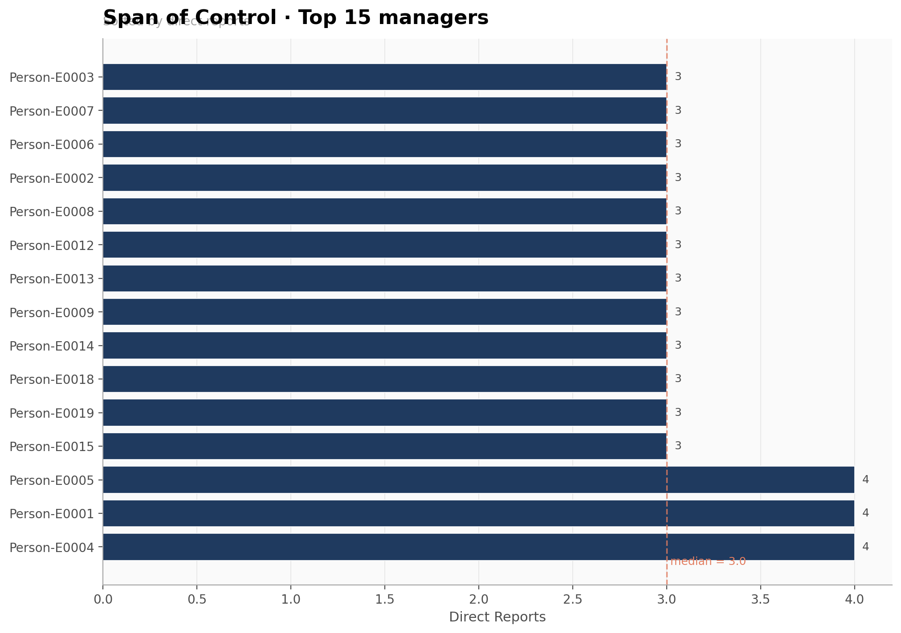
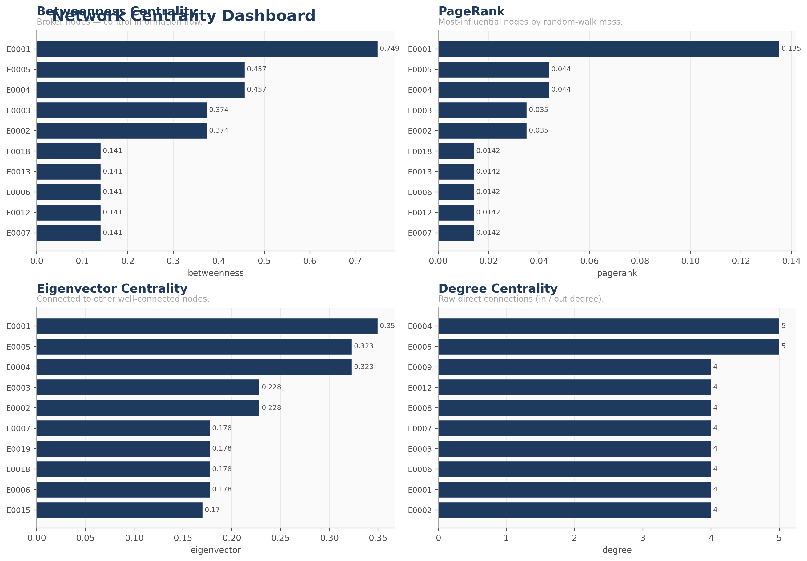
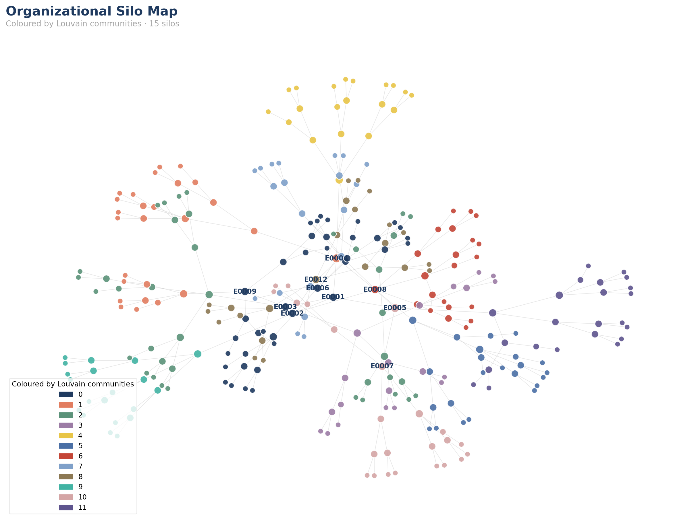
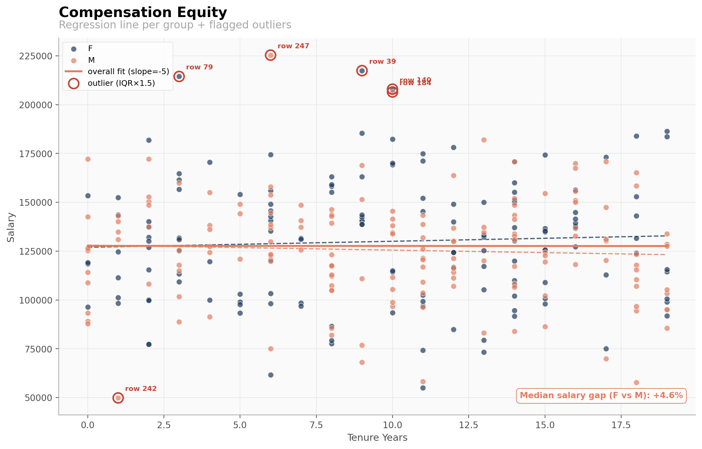

# pyduck-ona-viz

[](https://github.com/ezraair555/pyduck-ona-viz/actions/workflows/ci.yml)
[](https://pypi.org/project/pyduck-ona-viz/)
[](https://pypi.org/project/pyduck-ona-viz/)
[](https://github.com/ezraair555/pyduck-ona-viz)
[](LICENSE)

> Publication-quality visualizations for organizational chart analysis
> and people analytics. Companion package to
> [`pyduck-ona`](https://github.com/ezraair555/pyduck-ona).

`pyduck-ona-viz` takes the DuckDB-relation outputs of `pyduck-ona`
(hierarchy stats, centrality frames, communities, attrition tables…)
and turns them into polished, presentation-ready figures.

- **Static matplotlib figures** for embedding into reports and slide decks.
- **Interactive HTML** (D3 + Plotly + pyvis) for exploratory dashboards.

The design language is consistent across every function: a deep-blue /
warm-gray / coral palette, no chartjunk, 11 pt axis labels, 16 pt titles,
150 DPI for screen / 300 DPI for print.

---

## Installation

```bash
pip install pyduck-ona-viz

# For the interactive dashboards (Plotly HTML, pyvis silo maps):
pip install "pyduck-ona-viz[interactive]"

# To also pull in pyduck-ona itself:
pip install "pyduck-ona-viz[full]"
```

Or, from this repo:

```bash
pip install -e .
pip install -e ".[interactive]"
```

---

## Quick start

```python
import pandas as pd
import pyduck_ona_viz as viz

# Build a tiny synthetic org — no external database needed.
hierarchy = pd.DataFrame({
    "employee_id": ["CEO", "VP1", "VP2", "M1", "M2", "IC1"],
    "supervisor_id": [None, "CEO", "CEO", "VP1", "VP2", "M1"],
})
metadata = pd.DataFrame({
    "employee_id": hierarchy["employee_id"],
    "name": [f"Person-{e}" for e in hierarchy["employee_id"]],
    "department": ["Exec", "Eng", "Sales", "Eng", "Sales", "Eng"],
    "title": ["CEO", "VP", "VP", "Manager", "Manager", "IC"],
})

# Interactive org chart
html = viz.org_chart_tree(
    hierarchy,
    metadata=metadata,
    color_by="department",
    title="Acme Corp · Q4 2026",
)

# Span of control
stats = pd.DataFrame({
    "employee_id": ["CEO", "VP1", "VP2", "M1", "M2"],
    "direct_reports": [2, 2, 1, 1, 0],
    "total_reports": [5, 3, 2, 1, 0],
    "levels_below": [2, 1, 1, 0, 0],
})
fig = viz.span_of_control(stats, metadata=metadata, top_n=10)

# One-page executive dashboard
dash_html = viz.summary_dashboard(stats)
```

---

## Functions

| Function | Output | Use case |
|---|---|---|
| `org_chart_tree` | Interactive HTML (D3) | Executive org chart with collapsible nodes. |
| `reporting_chain_walk` | matplotlib Figure | Clean path from any employee up to the top. |
| `span_of_control` | Figure or Plotly HTML | Top managers by direct reports. |
| `span_vs_depth` | Figure | Quadrant bubble chart (efficient / top-heavy / flat / deep). |
| `hierarchy_depth_heatmap` | Figure | Matrix of employees × levels. |
| `centrality_dashboard` | Figure (2×2) | Compare betweenness / PageRank / eigenvector / degree. |
| `silo_map` | HTML or Figure | Community-coloured network map. |
| `attrition_heatmap` | Figure | Department × level attrition rates. |
| `compensation_equity` | Figure | Tenure / level vs salary, with regression + outliers. |
| `summary_dashboard` | HTML | One-page executive dashboard. |

---

## Examples

### Interactive org chart

```python
html = viz.org_chart_tree(
    long_df,
    metadata=metadata,
    color_by="department",
    title="Acme Corp · Q4 2026",
)
Path("org.html").write_text(html)
```


### Span of control

```python
fig = viz.span_of_control(
    stats_df,
    metadata=metadata,
    top_n=15,
    color_by_department=True,
)
fig.savefig("span.png", dpi=300, bbox_inches="tight")
```



### Centrality dashboard

```python
fig = viz.centrality_dashboard(
    betweenness=b.df(),
    pagerank=pr.df(),
    eigenvector=ev.df(),
    degree=dg.df(),
    metadata=metadata,
    top_n=10,
)
```



### Silo map

```python
# Interactive HTML
html = viz.silo_map(edges_df, communities=comms.df(), return_html=True)

# Static fallback for a slide deck
fig = viz.silo_map(edges_df, communities=comms.df(), return_html=False)
```



### Compensation equity

```python
fig = viz.compensation_equity(
    comp_df,
    x_col="tenure_years",
    y_col="salary",
    group_col="gender",
)
```



### Summary dashboard

```python
html = viz.summary_dashboard(
    hierarchy_stats=stats_df,
    betweenness=b.df(),
    pagerank=pr.df(),
    diversity=diversity_df,
    attrition=attrition_df,
)
Path("dashboard.html").write_text(html)
```


---

## Design language

All functions share a single visual identity defined in
`pyduck_ona_viz.theme`:

- **Palette**: deep blue (`#1F3A5F`), coral accent (`#E27D60`), warm gray
  text (`#4D4D4D`), sage success (`#5B9279`), brick danger (`#C44536`).
- **Typography**: DejaVu Sans throughout. Titles 16 pt semibold, axes 11 pt,
  ticks 10 pt, annotations 9 pt.
- **Layout**: `constrained_layout=True` everywhere; no top/right spines
  on bar charts; only horizontal grid on bar charts.
- **DPI**: 150 default; pass `dpi=300` to `savefig` for print.
- **Categorical colour cycling**: deterministic from
  `pyduck_ona_viz.CATEGORICAL`.

If you need a different brand palette, copy `theme.py` and override
`PALETTE` / `CATEGORICAL` — every function reads from there.

---

## API patterns

Every visualization function:

1. **Accepts a DataFrame** (the `.df()` of a pyduck-ona relation) plus
   optional `metadata=` DataFrame keyed by employee id.
2. **Returns either** a `matplotlib.figure.Figure` or a `str` of HTML.
   Nothing is ever rendered to screen — `plt.show()` is never called.
3. **Validates input** column names and raises `KeyError` / `TypeError`
   with clear messages.

Interactive variants are exposed via `return_html=True` on the functions
that support them (`span_of_control`, `silo_map`).

---

## Running the demo

```bash
git clone https://github.com/ezraair555/pyduck-ona-viz
cd pyduck-ona-viz
pip install -e ".[interactive,full]"
python examples/full_viz_demo.py
```

The demo builds a synthetic 300-person org with realistic hierarchy stats,
runs every visualization, and writes them to `examples/output/`.
See [`examples/README.md`](examples/README.md) for the output catalogue.

---

## Testing

```bash
pytest tests/
```

The test suite contains **126 collected tests** (125 run by default; one
slow performance smoke is skipped unless `-m slow` is passed). Current line
coverage is **≥90%**.

---

## Security

If you discover a security issue, please follow the process in
[`SECURITY.md`](SECURITY.md). Do **not** open a public issue for
vulnerabilities.

---

## Contributing

Pull requests are welcome. See [`CONTRIBUTING.md`](CONTRIBUTING.md) for
setup, lint commands, and PR expectations.

---

## Documentation

Full API docs are built with MkDocs and hosted at
<https://ezraair555.github.io/pyduck-ona-viz/>.
To build locally:

```bash
pip install -e ".[all,dev]"
mkdocs serve
```

---

## License

MIT © 2026 EzraAir555. See [LICENSE](LICENSE).
