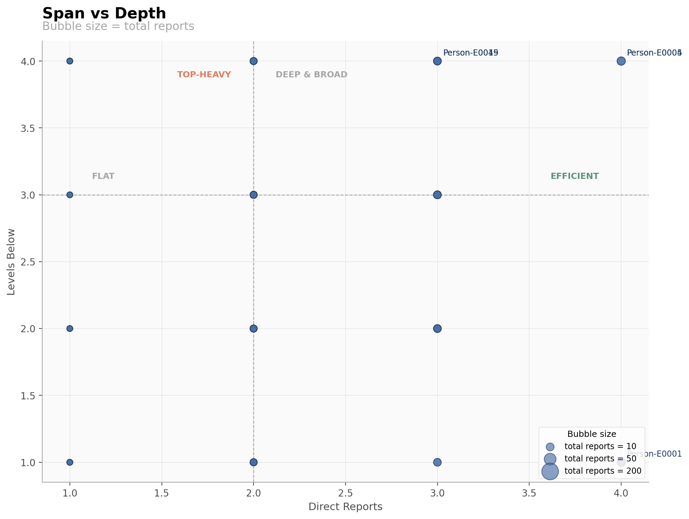
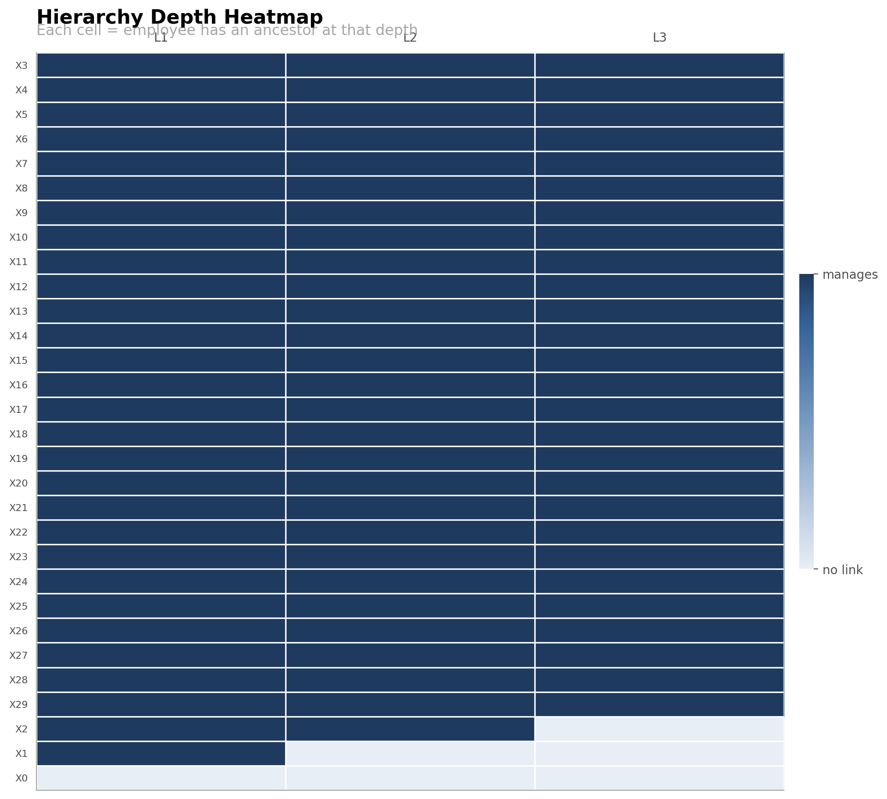
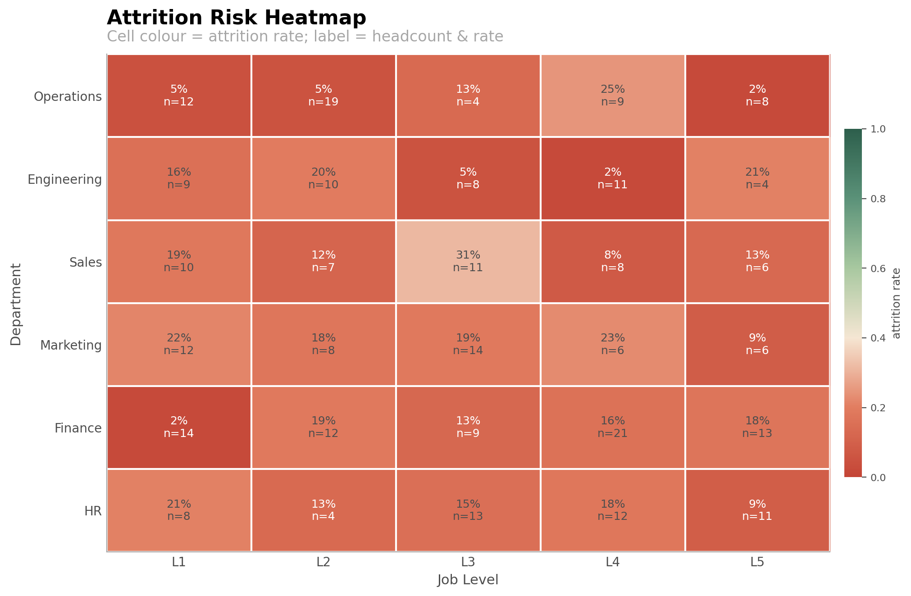
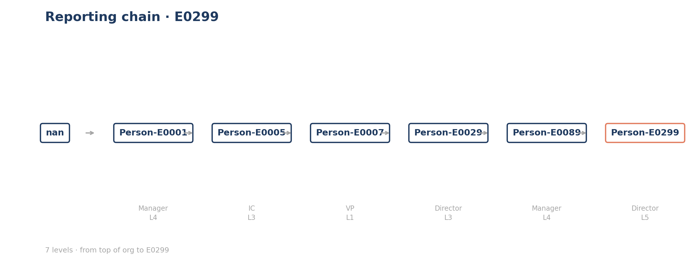

> Publication-quality visualizations for organizational chart analysis
> and people analytics. Companion package to
> [pyduck-ona](https://github.com/ezraair555/pyduck-ona).

`pyduck-ona-viz` turns the DuckDB-relation outputs of `pyduck-ona`
(hierarchy stats, centrality frames, communities, attrition tables, …)
into polished, presentation-ready figures.

- **Static matplotlib figures** for reports and slide decks.
- **Interactive HTML** (D3 + Plotly + pyvis) for exploratory dashboards.

---

## Installation

```bash
pip install pyduck-ona-viz

# For interactive dashboards (Plotly HTML, pyvis silo maps):
pip install "pyduck-ona-viz[interactive]"

# To also pull in pyduck-ona itself:
pip install "pyduck-ona-viz[full]"
```

---

## Quick start

```python
import pandas as pd
import pyduck_ona_viz as viz

# Synthetic org for a self-contained example
hierarchy = pd.DataFrame({
    "employee_id": ["CEO", "VP1", "VP2", "M1", "M2", "IC1"],
    "supervisor_id": [None, "CEO", "CEO", "VP1", "VP2", "M1"],
})
metadata = pd.DataFrame({
    "employee_id": hierarchy["employee_id"],
    "name": [f"Person-{e}" for e in hierarchy["employee_id"]],
    "department": ["Exec", "Eng", "Sales", "Eng", "Sales", "Eng"],
    "title": ["CEO", "VP", "VP", "Manager", "Manager", "IC"],
})

# 1. Interactive org chart
html = viz.org_chart_tree(
    hierarchy,
    metadata=metadata,
    color_by="department",
    title="Acme Corp · Q4 2026",
)

# 2. Span of control
stats = pd.DataFrame({
    "employee_id": ["CEO", "VP1", "VP2", "M1", "M2"],
    "direct_reports": [2, 2, 1, 1, 0],
    "total_reports": [5, 3, 2, 1, 0],
    "levels_below": [2, 1, 1, 0, 0],
})
fig = viz.span_of_control(stats, metadata=metadata, top_n=10)

# 3. One-page dashboard
html_dash = viz.summary_dashboard(stats)
```

---

## API overview

| Function | Output | Use case |
|---|---|---|
| `org_chart_tree` | Interactive HTML (D3) | Executive org chart with collapsible nodes. |
| `reporting_chain_walk` | matplotlib Figure | Clean path from any employee up to the top. |
| `span_of_control` | Figure or Plotly HTML | Top managers by direct reports. |
| `span_vs_depth` | Figure | Quadrant bubble chart. |
| `hierarchy_depth_heatmap` | Figure | Matrix of employees × levels. |
| `centrality_dashboard` | Figure (2×2) | Compare centrality measures. |
| `silo_map` | HTML or Figure | Community-coloured network map. |
| `attrition_heatmap` | Figure | Department × level attrition rates. |
| `compensation_equity` | Figure | Tenure / level vs salary. |
| `summary_dashboard` | HTML | One-page executive dashboard. |

See the [API reference](api/index.md) for full docstrings.

---

## Example gallery

Run the end-to-end demo to regenerate these outputs:

```bash
pip install -e ".[all,dev]"
python examples/full_viz_demo.py
```

Outputs are written to `examples/output/`.

| Output | Description |
|---|---|
|  | Top managers by direct reports. |
|  | Span × depth quadrant bubble chart. |
|  | Employees × levels matrix. |
|  | 2×2 centrality comparison. |
|  | Community-coloured network. |
|  | Department × level attrition risk. |
|  | Tenure vs salary with regression. |
|  | Path from employee to top. |

Interactive HTML artifacts (`09_org_chart.html` and `10_summary_dashboard.html`)
are also produced.

---

## Contributing and security

- See [CONTRIBUTING.md](../CONTRIBUTING.md) for dev setup, test commands, and
  PR expectations.
- See [SECURITY.md](../SECURITY.md) for vulnerability disclosure.
